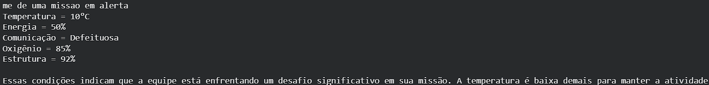
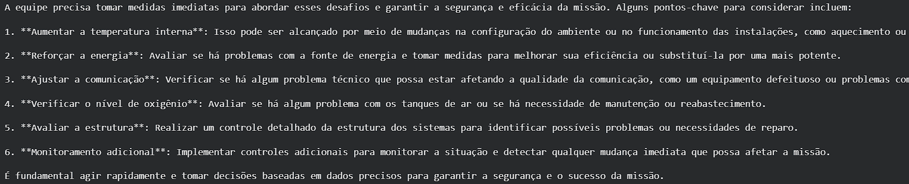
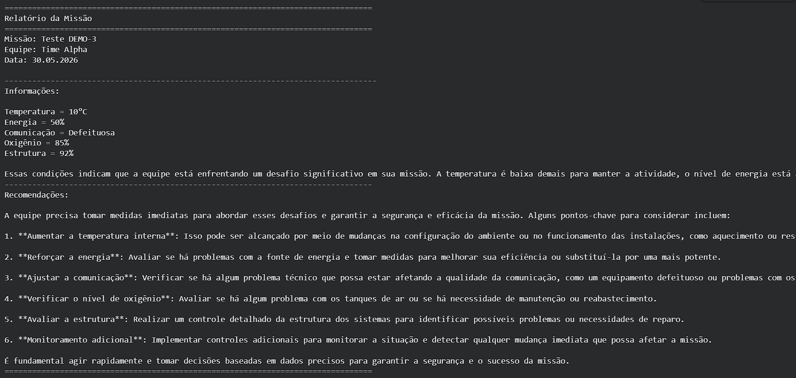

# Mission Control AI - [DEMO-3]

Gabriel Silveira - RM: 568910  
André Félix - RM: 571691  
  
## Explicação
Para simular uma missão espacial, o código usa de duas instâncias de inteligência artifical do Ollama para:  
Criar 5 diferentes dados: temperatura, energia, comunicação, oxigênio e estrutura.  
A tebela a seguir mostra o mínimo necessário para um dado ser considerado normal.  

|   Variável    |       Normalidade       |
|:-------------:|:-----------------------:|
|  Temperatura  |    Entre 10°C e 30°C    |
|    Energia    |      Acima de 35%       |
|  Comunicação  |  Normal ou Defeituoso   |
|   Oxigênio    |      Acima de 90%       |
|   Estrutura   |      Acima de 80%       |

---

Exemplo da geração da IA:

---

A seguir, para analisar os dados e sugerir recomendações que evitem possíveis catástrofes, a segunda instância da IA recebe diretamente os dados da missão e com a mesma tabela de normalidade, analisa o que está fora dos padrões e gera recomendações de acordo com a necessidade.  

Exemplo de geração de recomendações:

---

Ao final, na última célula, os dados são colocados em uma relatório diretamente e mostrados.

Exemplo de relatório:

## Como Executar

Para executar o código, é só entrar no link:
[Acessar Notebook](https://colab.research.google.com/drive/1qB12JRQm_6-UqO3E7rltJoK4SAoxim4J?usp=sharing)  

1 - Rode as células em ordem, a primeira instância da IA vai te pedir um input.  
(Caso ocorra um erro por não encontrar o modelo Ollama, rode as primeiras células de novo até funcionar)  
2 - Coloque se deseja uma simulação normal, em alerta ou crítica.  
3 - Continue rodando em ordem e o relatório terá todas as informações criadas.

## Vídeo Demonstração

[Assistir Vídeo](https://youtu.be/lgqG8pcTOBA)